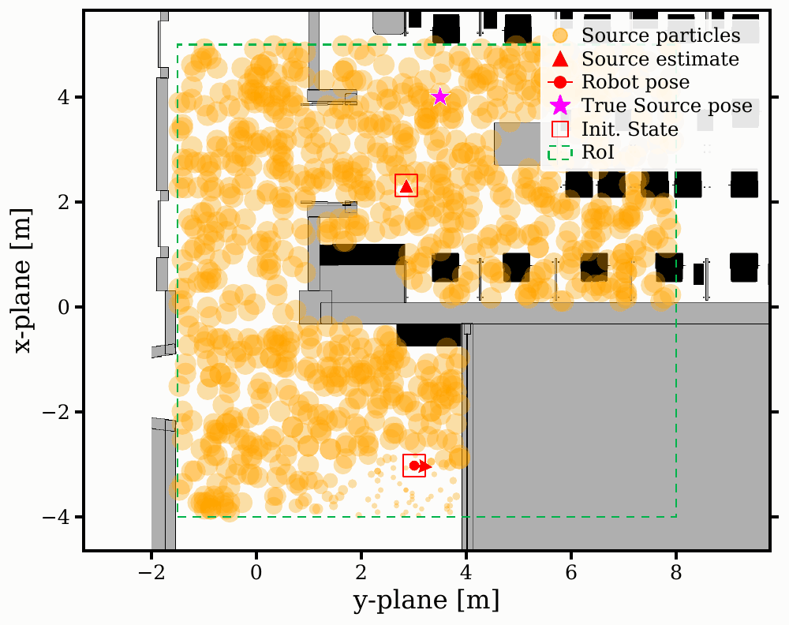

# Robust Active RF Source Localization in Multipath Environments using Neural Ray Predictor

ROS Noetic source localization with a Neural Ray Predictor, Isaac Sim robot
navigation, and a Sionna RT worker in a separate Python environment.

[Run commands](#run-commands) · [Installation](#installation) ·
[Example images and GIF](#recorded-example) · [Simulation assets](docs/ASSETS.md)

## Simulation Platform
The simulation used in this project is available at [rfdt](https://github.com/skepsl/rfdt)

## Run commands

Run these commands **from this repository's root**, using a separate terminal
for each process. Complete [installation](#installation) once first.

**Build once:**

```bash
./scripts/build.sh
```

**Terminal 1 — navigation and RViz:**

```bash
./scripts/run_navigation.sh map_file:=21202.yaml
```

Open `assets/isaac/21_bldg_environment_and_robot_shifted.usd` in Isaac Sim 4.1,
enable the ROS 1 bridge (`omni.isaac.ros_bridge`), and press **Play**. Initialize
AMCL at the actual robot starting pose using RViz's **2D Pose Estimate**.
See [asset dependencies and verification limits](docs/ASSETS.md).

**Terminal 2 — Sionna, in its separate environment:**

```bash
conda activate atdf-sionna
./scripts/run_sionna.sh
```

An existing compatible Sionna environment can also be used. The script uses its
active `python3`, or `ATDF_SIONNA_PYTHON` if you set that variable. Do not activate
the ROS Python environment in this terminal.

**Terminal 3 — optional ROS recording, started before the finder:**

```bash
./scripts/record.sh
```

**Terminal 4 — finder with the recorded example's settings:**

```bash
./scripts/run_finder.sh \
  rx_init_x:=-3.0 rx_init_y:=3.0 rx_init_yaw_deg:=90.0 \
  tx_true_x:=4.0 tx_true_y:=3.5 \
  use_pf_bounds:=true \
  x_min:=-4.0 x_max:=5.0 y_min:=-1.5 y_max:=8.0 \
  show_rf_particles:=true show_measurement_headings:=true \
  plot_every:=1
```

The initial pose is the first **robot base navigation goal**, not a teleport
or an AMCL initialization. Angles are degrees: 0 faces +x, 90 faces +y.
New plots and complete numerical snapshots save in unique folders under
`~/atdf_results`; the node prints the absolute path. Recordings save under
`~/atdf_recordings`. Press Ctrl+C in the recording terminal to finalize its bag.

The scripts source ROS and this checkout automatically. The corresponding
ROS launches are `navigator.launch`, `example_8985.launch`, and `record.launch`
in package `atdf_video`.

## Recorded example



Run `run_20260911081435215164Z_8985`: six saved measurement plots. The GIF uses
**presentation timing**: one second per step, with the last held for three
seconds. It is not real-time playback of Isaac Sim.

[Final image](examples/run_20260911081435215164Z_8985/final.png) ·
[Original final PDF](examples/run_20260911081435215164Z_8985/pdf/8985_006.pdf) ·
[All frames, original PDFs, and numerical snapshots](examples/run_20260911081435215164Z_8985/README.md)

The last recorded estimate is approximately `(3.9486, 3.4535)` m for a source
at `(4.0, 3.5)` m: a recorded error of `0.0693` m. This is the last saved frame;
it does not by itself establish the algorithm's convergence condition. Running
the same settings again will produce a new stochastic particle-filter trial.

## Installation

The ROS side targets Ubuntu 20.04, ROS Noetic, and Python 3.8. Isaac Sim 4.1
runs separately with its ROS 1 bridge. The Sionna worker needs a separate
Python 3.10+ environment; the supplied setup below uses Python 3.12 and
Sionna RT 1.2.1. Install ROS Noetic, Isaac Sim, NVIDIA drivers, and Conda before
these project-specific steps.

**ROS dependencies and Python environment:**

```bash
source /opt/ros/noetic/setup.bash
sudo apt-get update
sudo apt-get install -y build-essential cmake python3-venv python3-rosdep poppler-utils
# On a machine where rosdep has never been initialized, run: sudo rosdep init
rosdep update
rosdep install --from-paths src --ignore-src --rosdistro noetic -r -y

/usr/bin/python3 -m venv --system-site-packages .venv-ros
source .venv-ros/bin/activate
python -m pip install --upgrade pip 'setuptools<75' wheel
python -m pip install -r requirements-ros.txt
python -m pip install torch==2.4.1 --index-url https://download.pytorch.org/whl/cu118
./scripts/build.sh
```

The CUDA 11.8 PyTorch command follows the [official PyTorch 2.4.1 installation
options](https://pytorch.org/get-started/previous-versions/#v241). The ROS
requirements select versions supporting Python 3.8, including
[NumPy 1.24.4](https://pypi.org/project/numpy/1.24.4/) and
[Matplotlib 3.7.5](https://pypi.org/project/matplotlib/3.7.5/).

**Sionna environment, in a fresh terminal at the repository root:**

```bash
conda create -n atdf-sionna python=3.12 -y
conda activate atdf-sionna
python -m pip install -r sionna/requirements.txt
./scripts/run_sionna.sh --help
```

The checkpoint and Sionna scene/meshes are included. The worker's default
scene is `assets/sionna/21202_building_full_room_shifted.xml`. Both worker and
finder exchange files in `~/atdf_database`. The worker waits for the first
request; no manual creation of request files is needed. Use one finder per
exchange directory.

## Experiment options

| Option | Meaning |
| --- | --- |
| `rx_init_x`, `rx_init_y`, `rx_init_yaw_deg` | Initial robot base measurement goal |
| `rx_init_reference:=antenna` | Interpret that goal as antenna position/lobe heading |
| `tx_true_x`, `tx_true_y` | Simulated transmitter and displayed ground truth |
| `use_pf_bounds:=true`, `x_min`, `x_max`, `y_min`, `y_max` | Source-only PF search rectangle |
| `show_rf_particles:=false` | Hide the source particle cloud in RViz |
| `show_measurement_headings:=true` | Draw measured robot orientations in RViz |
| `plot_every:=1` | Save every step as a PDF; enabled by default |
| `plot_dir:=/path/to/results` | Parent directory for unique run folders |
| `goal_timeout:=300.0` | Navigation budget in simulation seconds |
| `goal_timeout:=0` | Disable the travel duration limit; action failures still apply |
| `map_file:=21202A.yaml` | Select the included alternate occupancy map |

The example uses `21202.yaml` for both navigation and the finder. The navigation
launch's standalone default is `21202A.yaml`, matching the packaged working
configuration. Pass `map_file` explicitly to both processes when changing the
experiment's map. The historical example images retain their original map.

For a different exchange directory, pass
`--database-dir /path/to/exchange` to `run_sionna.sh` and
`sionna_database_dir:=/path/to/exchange` to `run_finder.sh`.

Source search bounds do not restrict robot navigation. The ground-truth topic
`/robot_pose_gt` supplies the physical measurement pose; AMCL/TF drives
navigation. Isaac, the occupancy map, and the Sionna scene must share the same
coordinates. Required bridge topics are `/clock`, `/scan`, `/odom_scout/odom`,
`/imu/data`, `/robot_pose_gt`, and `/cmd_vel`.

## Saved results and plots

Each run saves its prior and every completed measurement as NPZ/JSON snapshots:
full particle means, weights, covariances, raw measurement, robot and antenna
pose histories, source estimates, timestamps, and metrics. PDF rendering is
independent of the RViz visibility settings. Explicit `plot_every:=0` disables
PDFs while numerical snapshots continue to save.

PDFs use connected robot circles with heading arrows, source-estimate
triangles, a magenta true-source star, orange source particles, initial-state
squares, and a dashed green RoI. World y is horizontal and world x is vertical.
Nonzero stored component covariances produce two-sigma ellipses; zero-covariance
bootstrap particles are shown as points. RViz retains its own color palette.

To regenerate the supplied PNGs/GIF from their original PDFs:

```bash
source .venv-ros/bin/activate
python examples/run_20260911081435215164Z_8985/render_media.py
```

## Contents and checks

`src/atdf_video` contains the finder, helpers, checkpoint, maps, launch files,
RViz preset, and navigation configuration. `src/teleop_twist_keyboard` contains
the optional keyboard controller. `sionna` contains the independent worker.
`assets` contains the simulation scene files. `examples` contains the requested
recorded run and reproducible media.

Run the checks without launching ROS nodes or the simulator:

```bash
source /opt/ros/noetic/setup.bash
source .venv-ros/bin/activate
python -m unittest discover -s tests -v
python -m unittest discover -s src/atdf_video/tests -v
python sionna/atf_testing.py --help
```

See [validation details](docs/VALIDATION.md) for what was checked when this
folder was assembled, and [asset dependencies](docs/ASSETS.md) for the remaining
Isaac material references. Package/license declarations and existing third-party
headers are retained; asset notices are listed with those assets.
